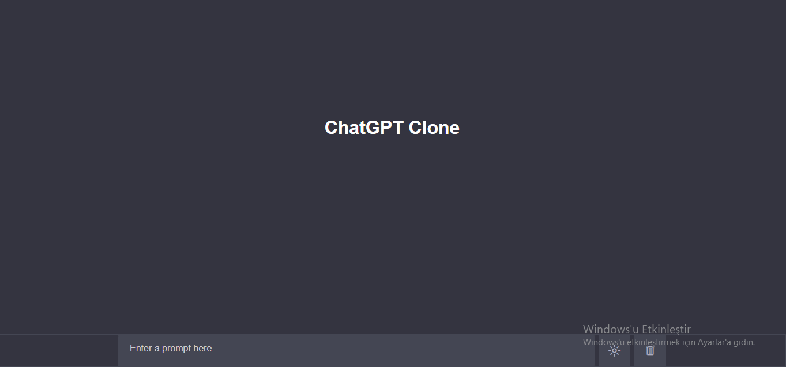

# ChatGPT Clone

This project includes a simple ChatGPT clone that creates a chat interface using OpenAI's GPT-3 model.

## Getting Started

Clone the project files to your computer and then follow the necessary steps to start the project.

### Requirements

The following software needs to be installed for the project:

- Web browser
- Git (optional)

### Installation

1. Clone the project to your computer:

    ```bash
    git clone https://github.com/YOUR_USERNAME/ChatGPT-Clone.git
    cd ChatGPT-Clone
    ```

2. Set up your OpenAI API Key:

    Replace the `API_KEY` variable in the `main.js` file with your own OpenAI API key.

3. Open in your Web Browser:

    Open the project by double-clicking the `index.html` file or entering the file path into your browser's address bar.

4. Start Chatting:

    Enter a message in the chat box and start the conversation by clicking the "send" button or pressing the Enter key.

## Technologies Used

- HTML
- CSS
- JavaScript

## Contributing

Learn how to contribute by checking the contributions.md file.

## Screenshots



## License

This project is licensed under the [MIT License](LICENSE). For more details, please see the LICENSE file.

